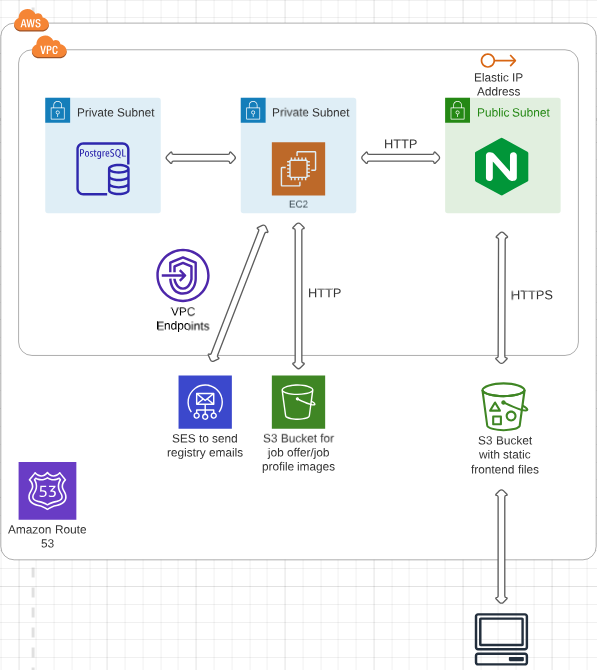

# ExplodeJobs

This repository is only a description of what the [explodejobs.pl](https://explodejobs.pl) is. The
code is stored in private repository hosted on Gitlab.

## 1. What [explodejobs.pl](https://explodejobs.pl) is
ExplodeJobs is a job portal for interns and juniors. I know that finding your first job 
is difficult. Many of my friends have similar thoughts. You have to send emails to 
all the employers in the area to ask if they are hiring students/juniors and expect them to respond at least within a few days.
 So I decided to help these young people and create one place where they can find their first dream job
while helping employers find the best talent in town.

## 2. How many users use explodejobs
Unfortunately, explodejobs is currently not active as I decided to turn off all social media ads due to not getting
expected results.
 However, when ads were active - the app was used by thousands of users what is proved below

## 3. In what techstack is explodejobs written
 - ### Backend
    - Kotlin `1.7.21`
    - Spring Boot `3.0.0`
      - Web
      - Data JPA
      - Security
      - Mail
    - PostgreSQL `14`
    - Gradle `7.5.1`
    - Docker - only local development
 - ### Frontend
    - React `18.2.0`
    - Typescript `4.8.4` 
    - React Query `4.18.0` 
    - Axios `0.27.2` 
    - MaterialUI `v5`
    - TailwindCSS `3.1.8`

## 4. Architecture
I decided to deploy the app to `AWS` like the following:

